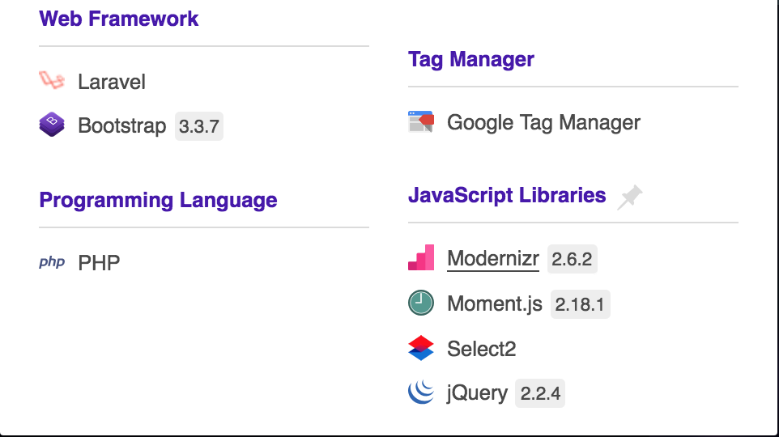

# fortify-re
Reverse Engineering the competition

Objective of this repo is to share analysis of the website https://ftw.in/game/fortnite

### Steps Taken
1. Download [wappalyzer](https://www.wappalyzer.com/) for the browser of your choice.    
2. Open the page mentioned above and look at wappalyzer results.

Findings.

#### Explanations:
* Laravel is a famous php framework
* Bootstrap is a framework from twitter for websites
* PHP is a language used by devs to mock other devs
* Modernizr is used for browser detection
* Moments.js is used to time manipulation
* Select2 javascript framework for select boxes
* jQuery framework that provides additional functionality to webpages
